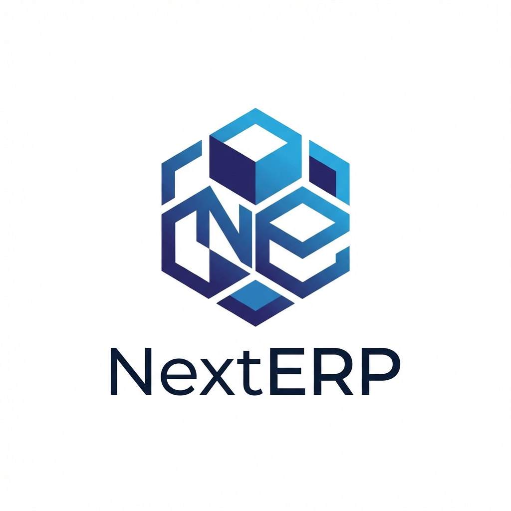
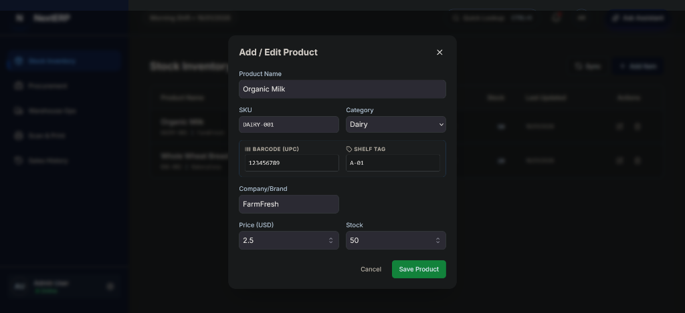
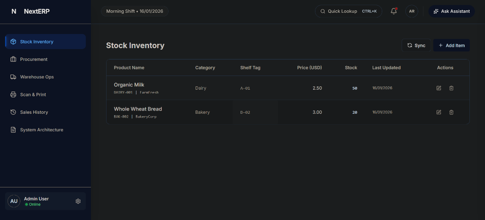

# NextERP - Modern Retail Management System

<div align="center">
  
  <br/>
  <h1>NextERP</h1>
  <p>
    
    
    
    
  </p>
</div>

A professional, cloud-ready Enterprise Resource Planning (ERP) solution designed for modern retail management. NextERP streamlines inventory tracking, procurement, warehouse management, and sales monitoring into a single, cohesive dashboard.

## 📸 Screenshots

<div align="center">
  
  <p><em>Real-time Inventory Dashboard</em></p>
  <br/>
  
  <p><em>Product Management & Data Entry</em></p>
</div>

## 🚀 Features

-   **Inventory Management**: Real-time stock tracking with SKU, barcode, and shelf-tag support.
-   **Procurement Module**: Manage Purchase Requests, Purchase Orders, and Supplier Invoices.
-   **Warehouse Operations**: Track Goods Receipt Notes (GRN), Stock Transfers, and Returns.
-   **Label Printing**: Integrated module for generating barcode labels for shelf items.
-   **Smart Notifications**: Real-time alerts for low stock and system events.
-   **AI-Powered Insights**: (Optional) Intelligent chatbot for inventory queries (Powered by Google Gemini).
-   **Modern UI/UX**: Built with React, Tailwind CSS, and Framer Motion for a responsive, fluid experience.
-   **Multi-Language Support**: Full RTL support (English/Arabic).

## 🛠️ Technology Stack

-   **Frontend**: React, TypeScript, Vite
-   **Styling**: Tailwind CSS, PostCSS
-   **Animation**: Framer Motion
-   **Icons**: Lucide React
-   **AI Integration**: Google Generative AI SDK

## 📦 Installation

1.  Clone the repository:
    ```bash
    git clone https://github.com/yourusername/nexterp.git
    cd nexterp
    ```
2.  Install dependencies:
    ```bash
    npm install
    ```
3.  Run the development server:
    ```bash
    npm run dev
    ```

## 🔑 Configuration

To enable AI features, create a `.env.local` file in the root directory and add your API key:
```env
VITE_GEMINI_API_KEY=your_api_key_here
```
*If no key is provided, the system falls back to a demo mode.*

## 📄 License

This project is licensed under the MIT License - see the [LICENSE](LICENSE) file for details.

---
*Built for the future of retail.*
